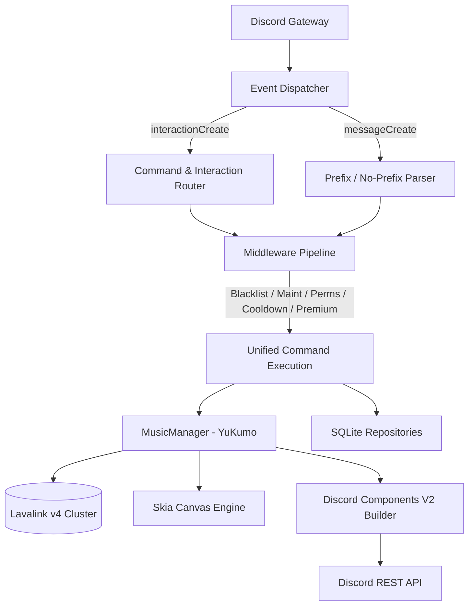

# Kira — Premium Discord Music Bot

<div align="center">

```
   ██╗  ██╗██╗██████╗  █████╗ 
   ██║ ██╔╝██║██╔══██╗██╔══██╗
   █████╔╝ ██║██████╔╝███████║
   ██╔═██╗ ██║██╔══██╗██╔══██║
   ██║  ██╗██║██║  ██║██║  ██║
   ╚═╝  ╚═╝╚═╝╚═╝  ╚═╝╚═╝  ╚═╝
```

**Next-Generation Production-Ready Discord Music Application**  
*Built with Node.js • YuKumo (Lavalink v4) • Pure Discord Components V2 • Skia Canvas*

[](https://nodejs.org)
[](https://discord.js.org)
[](https://yukumo.vercel.app)
[](https://discord.com)
[](LICENSE)

</div>

---

## 📖 Table of Contents

- [Overview](#-overview)
- [Key Features](#-key-features)
- [Design Philosophy & Components V2](#-design-philosophy--components-v2)
- [System Architecture](#-system-architecture)
- [Quick Start Guide](#-quick-start-guide)
- [Configuration](#-configuration)
- [Command Suite](#-command-suite)
- [Premium System & Tiers](#-premium-system--tiers)
- [Audio Filters & DSP](#-audio-filters--dsp)
- [Docker & Production Deployment](#-docker--production-deployment)
- [Documentation Index](#-documentation-index)
- [Testing & Quality Assurance](#-testing--quality-assurance)
- [License](#-license)

---

## 🌌 Overview

**Kira** is an enterprise-grade, modern Discord music bot engineered specifically for high concurrency, ultra-low latency audio playback, and a refined user interface. 

Departing from traditional embed-heavy designs and emoji clutter, Kira utilizes **Discord Components V2** (`Containers`, `Sections`, `Text Displays`, `Separators`, `ActionRows`, `Buttons`, `Select Menus`, and `Modals`) alongside dynamic **Skia Canvas** audio cards to provide a native, app-like streaming experience.

---

## ✨ Key Features

- **100% Discord Components V2 UI**: Zero legacy embeds. Every player card, queue page, lyrics viewer, settings panel, and confirmation dialog uses native Components V2 cards.
- **YuKumo Lavalink v4 Client**: High-throughput audio node load balancing, automatic reconnection, queue management, and low latency track loading.
- **Dynamic Skia Canvas Visuals**: High-resolution dark obsidian player banners with album art, ambient lighting glow, track progress bars, and requester metadata.
- **Unified Command Execution**: Slash commands (`/play`), configurable prefix commands (`!play`), and Premium No-Prefix commands (`play`) share identical business logic through a unified `CommandContext`.
- **4-Tier Premium Entitlement Engine**: Fully configurable `Free`, `Silver`, `Gold`, and `Diamond` tiers supporting No-Prefix, 24/7 Voice Stay, Autoplay, large queues (up to 5,000 tracks), and custom playlists.
- **Interactive Server Settings & Setup Wizard**: Step-by-step interactive setup wizard (`/setup`) and a centralized Discord dashboard (`/settings`) for prefixes, DJ roles, channels, and playback rules.
- **Protected Developer Suite**: Isolated developer commands (`/dev nodes`, `/dev cache`, `/dev premium`, `/dev maintenance`, `/dev blacklist`) with live cluster telemetry.
- **SQLite Database with WAL Mode**: Embedded SQLite database (`better-sqlite3`) tracking guild configs, user preferences, favorites, playlists, listening history, and playback telemetry.

---

## 🎨 Design Philosophy & Components V2

Traditional Discord bots clutter chats with excessive emojis and garish embed borders. Kira enforces a strict, minimalist dark aesthetic:

- **Containers (`type: 17`)**: Serves as the outer structural card with subtle accent borders (`#5865F2`, `#2B2D31`, `#F59E0B`).
- **Text Displays (`type: 10`)**: Formats typography cleanly using Markdown headers and bulleted metadata.
- **Separators (`type: 14`)**: Creates visual rhythm with subtle divider lines.
- **ActionRows (`type: 1`) & Buttons (`type: 2`)**: Interactive controls with distinct styling (Primary, Secondary, Success, Danger, Link).
- **String Selects (`type: 3`)**: Filter presets, playlist selection, search picking, and help categorization.

---

## 🏗️ System Architecture



---

## 🚀 Quick Start Guide

### 1. Prerequisites
- **Node.js**: v18.0.0 or newer (v22+ recommended)
- **Lavalink v4**: A running Lavalink v4 server
- **Discord Bot Token**: From the [Discord Developer Portal](https://discord.com/developers/applications)

### 2. Installation
```bash
git clone https://github.com/Nex-Devz/Kira-Music.git
cd Kira-Music
npm install
```

### 3. Environment Configuration
Copy `.env.example` to `.env` and provide your credentials:
```env
DISCORD_TOKEN=your_bot_token_here
CLIENT_ID=your_client_id_here
OWNER_IDS=your_discord_user_id
DEV_IDS=your_discord_user_id
LAVALINK_NAME=primary-node
LAVALINK_HOST=127.0.0.1
LAVALINK_PORT=2333
LAVALINK_PASSWORD=youshallnotpass
DATABASE_PATH=./data/kira.db
DEFAULT_PREFIX=!
```

### 4. Running the Application
```bash
# Run integrity & test suite
npm test

# Start in production mode
npm start

# Or start in watch mode for development
npm run dev
```

---

## 🎛️ Command Suite

Kira includes **41 commands** organized into clear functional domains:

### Music & Playback
| Command | Aliases | Description |
| :--- | :--- | :--- |
| `/play <query>` | `!p`, `!play` | Play or queue a song or playlist from YouTube, Spotify, SoundCloud, or URL |
| `/search <query>` | `!find` | Interactive track search with Select Menus |
| `/pause` | `!halt` | Pause audio playback |
| `/resume` | `!unpause` | Resume paused playback |
| `/skip` | `!s`, `!next` | Skip currently playing track |
| `/previous` | `!prev`, `!back` | Play previously played track |
| `/stop` | `!leave` | Stop playback, clear queue, and leave voice channel |
| `/restart` | `!replay` | Restart current track from 00:00 |
| `/seek <time>` | `!jumpto` | Seek to timestamp (e.g. `1:30`, `90s`, `2m15s`) |
| `/forward <sec>` | `!fwd`, `!ff` | Fast-forward track by specified seconds |
| `/rewind <sec>` | `!rw` | Rewind playback by specified seconds |
| `/volume <0-150>` | `!vol`, `!v` | Adjust playback volume |
| `/nowplaying` | `!np` | Display current track interactive player card |
| `/loop <mode>` | `!repeat` | Set loop mode (`off`, `track`, `queue`) |
| `/shuffle` | `!mix` | Randomize order of tracks in the queue |
| `/autoplay` | `!ap` | Toggle automatic related song discovery on queue finish |
| `/247` | `!stay` | Toggle 24/7 persistent voice channel connection |
| `/lyrics [song]` | `!ly` | View paginated synchronized lyrics |
| `/recommend` | `!rec` | Discover and queue tracks recommended from current song |
| `/related` | `!similartracks` | Alias for `/recommend` |
| `/filters [preset]` | `!fx` | Audio tuning panel (Bass Boost, Nightcore, Vaporwave, 8D, Karaoke, Timescale) |

### Queue & Playlists
| Command | Subcommands | Description |
| :--- | :--- | :--- |
| `/queue` | `view`, `add`, `remove`, `move`, `clear`, `shuffle`, `jump` | Paginated queue management and track manipulation |
| `/playlist` | `create`, `delete`, `add`, `remove`, `play`, `list`, `view`, `import` | Manage custom personal playlists and import external collections |

### Library & Profile
| Command | Aliases | Description |
| :--- | :--- | :--- |
| `/favorite` | `!fav` | Toggle current playing track into personal favorites |
| `/favorites` | `!favs` | View, clear, or queue all saved favorites |
| `/history` | `!recent` | View recent listening history |
| `/profile [user]` | `!userinfo` | Render personalized Skia Canvas listening analytics card |
| `/stats` | `!leaderboard` | View server and global music listening statistics |

### Settings & Administration
| Command | Description |
| :--- | :--- |
| `/settings` | Centralized Components V2 server configuration dashboard |
| `/setup` | First-time server setup wizard for channels and roles |
| `/prefix <new>` | Update the command prefix for this server |
| `/dj [role]` | Designate a DJ role for playback controls |
| `/player [chan]` | Configure a dedicated text channel for the persistent player card |
| `/permissions` | View playback permission rules |
| `/premium` | View active plan, entitlements, and unlockable features |

### Utility & Developer Suite
| Command | Scope | Description |
| :--- | :--- | :--- |
| `/help [category]` | Public | Interactive Components V2 command browser |
| `/ping` | Public | Gateway and Lavalink node latency check |
| `/botinfo` | Public | Bot system telemetry, memory, and uptime |
| `/invite` | Public | Official bot invite link with permissions |
| `/support` | Public | Official support community server invite |
| `/dev nodes` | Developer | Real-time Lavalink node CPU, memory, uptime, and latency |
| `/dev guild <id>` | Developer | Inspect server database record and active player state |
| `/dev player <id>` | Developer | Stop or destroy active player instance |
| `/dev premium` | Developer | Grant or revoke premium entitlements |
| `/dev cache` | Developer | Inspect or flush LRU memory caches |
| `/dev reload` | Developer | Hot reload command modules and registry |
| `/dev sync` | Developer | Force sync application slash commands globally |
| `/dev maintenance` | Developer | Toggle global maintenance mode |
| `/dev blacklist` | Developer | Manage blacklisted users and servers |

---

## 💎 Premium System & Tiers

| Feature | Free Tier | Silver Tier | Gold Tier | Diamond Tier |
| :--- | :---: | :---: | :---: | :---: |
| **Max Queue Size** | 100 tracks | 300 tracks | 1,000 tracks | 5,000 tracks |
| **Max Playlists** | 3 lists | 10 lists | 30 lists | 100 lists |
| **Tracks / Playlist** | 50 tracks | 150 tracks | 500 tracks | 2,000 tracks |
| **No-Prefix Commands** | ❌ | ✅ | ✅ | ✅ |
| **Autoplay Engine** | ❌ | ✅ | ✅ | ✅ |
| **24/7 Voice Stay** | ❌ | ❌ | ✅ | ✅ |
| **Audio Filter Presets** | Bass, Night, Vapor | + 8D, Karaoke | + Timescale, Tremolo | All Filters |
| **Priority Audio Nodes** | Standard | Standard | ✅ | ✅ |

---

## 🎚️ Audio Filters & DSP

Kira supports hardware-accelerated DSP audio filters powered by YuKumo:
- **Bass Boost**: Deep low-frequency equalizer boost.
- **Nightcore**: Pitch and tempo acceleration.
- **Vaporwave**: Pitch reduction and slow-motion tempo.
- **8D Spatial Audio**: 360-degree continuous stereo rotation.
- **Karaoke**: Vocal attenuation and mid-band suppression.
- **Timescale**: Granular speed, pitch, and playback rate tuning.

---

## 🐳 Docker & Production Deployment

Kira includes ready-to-use Docker and Docker Compose definitions for one-command deployment alongside Lavalink v4.

```bash
# Start Lavalink v4 and Kira Bot
docker compose up -d
```

See [docs/DEPLOYMENT.md](docs/DEPLOYMENT.md) for detailed production deployment instructions using PM2, systemd, or Docker.

---

## 📚 Documentation Index

- [Architecture Guide](docs/ARCHITECTURE.md) — Comprehensive technical architecture.
- [Commands Reference](docs/COMMANDS.md) — Detailed specifications for all 41 commands.
- [Discord Components V2 Guide](docs/COMPONENTS_V2.md) — Deep dive into the Components V2 UI system.
- [Premium System Guide](docs/PREMIUM.md) — Premium tier management and entitlement logic.
- [Production Deployment Guide](docs/DEPLOYMENT.md) — Production setup with PM2, Docker, and Lavalink.

---

## 🧪 Testing & Quality Assurance

Run the built-in automated test suite:
```bash
npm test
```

The test runner validates:
1. SQLite schema and repository CRUD operations.
2. Discord Components V2 structural compliance (`type: 17`, `type: 9`, `type: 10`, `type: 14`, `flags: 32768`).
3. Skia Canvas rendering pipelines for player and profile cards.
4. Command registry validity and Slash command builder completeness.
5. Premium entitlement evaluations and feature gating.

---

## 📄 License

Distributed under the MIT License. See [`LICENSE`](LICENSE) for details.